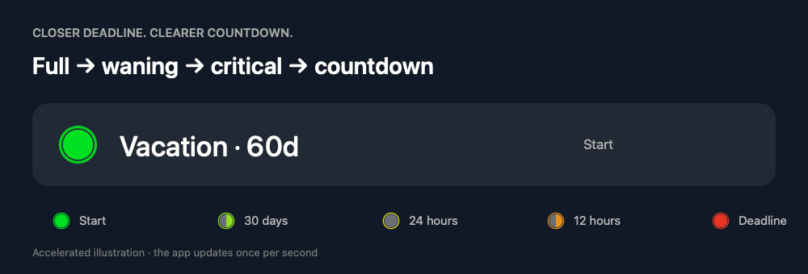
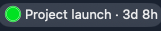
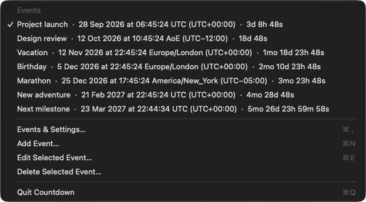
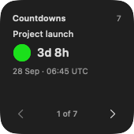
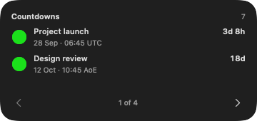
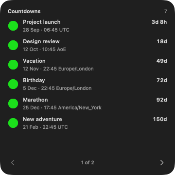
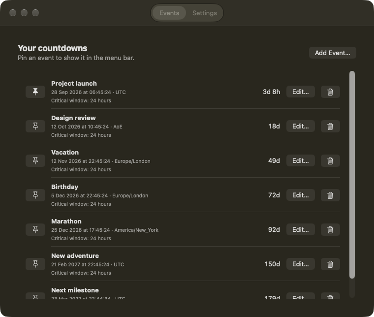
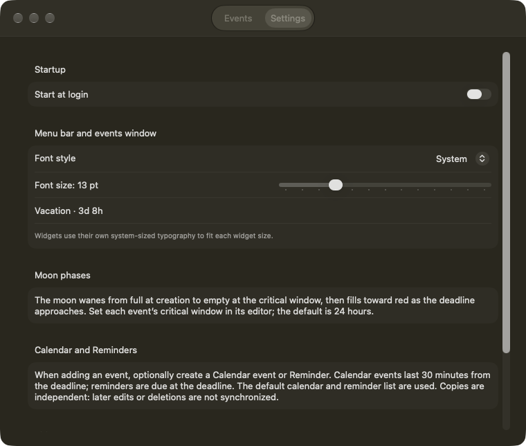

# Countdown Menu Bar

A small macOS menu bar app for counting down to exact event dates and times.

[Download the latest release](https://github.com/Kymer0615/mac_countdown/releases/latest)



**A glance is all it takes.** The moon wanes from creation to your critical window, then fills toward the deadline. The countdown moves from days to hours, minutes, and seconds.

*Accelerated illustration using the app’s moon-drawing code. The app updates once per second; it does not continuously loop through phases. [View the still image](docs/images/moon-progress.png).*

## Install with Homebrew

```sh
brew install --cask kymer0615/tap/countdown-menu-bar
open "/Applications/Countdown Menu Bar.app"
```

Requires macOS 13 or later, on Apple Silicon or Intel. Desktop widgets require macOS 14 or later.
The initial release is ad hoc signed and is not notarized by Apple. If macOS blocks the first launch, follow [Apple's instructions](https://support.apple.com/en-gb/102445) to allow it in **System Settings → Privacy & Security → Open Anyway**, then open it again.

If you already installed a copy manually, quit it and move that app bundle out of Applications before installing through Homebrew. Your saved events are stored separately and are retained.

```sh
brew update
brew upgrade --cask kymer0615/tap/countdown-menu-bar
# Remove the app (saved events are retained):
brew uninstall --cask countdown-menu-bar
```

## See it in action

### One countdown in your menu bar. Every event a click away.





Choose an event to pin its countdown to the menu bar. Add, edit, and delete events from the same dropdown.

### Your events, on your desktop

<table>
  <tr>
    <td align="center" valign="top">
      <strong>Small · one event</strong><br><br>
      <br><br>
      <strong>Medium · two events</strong><br><br>
      
    </td>
    <td align="center" valign="top">
      <strong>Large · six events</strong><br><br>
      
    </td>
  </tr>
</table>

*Menu screenshots and native widget view previews use sample events. Widget backgrounds can vary with your desktop settings. Every size has page arrows to browse the full event list.*

## Build and launch

Requires Xcode to build the app and its native widget extension. The menu bar app runs on macOS 13 or later; desktop widgets require macOS 14 or later. From this folder:

```sh
sh scripts/build-app.sh
open "dist/Countdown Menu Bar.app"
```

The app appears only in the menu bar. Click **⏳ Add event** to create your first event. Set its name, date, time down to the second, and time zone. Click an event in the dropdown to choose which countdown appears in the menu bar. The dropdown shows every saved event, its exact deadline and zone, and a detailed countdown. Use the dropdown to edit or delete the selected event.

## Progressive precision

The menu bar shows more detail as the deadline approaches:

| Time remaining | Example |
| --- | --- |
| 7 days or more | Vacation · 49d |
| 1–7 days | Vacation · 3d 8h |
| 1–24 hours | Vacation · 8h 24m |
| Under 1 hour | Vacation · 24m 16s |

These compact units use elapsed time (one day is 24 hours), rounding down except seconds, which round up. The dropdown retains calendar years, months, days, hours, minutes, and seconds.

The moon starts **full when you create an event** and wanes to empty as its critical window approaches. Inside that window it fills again toward the deadline. Color expresses urgency independently: green → yellow at the critical threshold → red at the deadline. A checkmark appears when the deadline is reached.

Set **Critical window (hours)** in each event’s editor, from 0.1 to 8760 hours; the default is **24 hours**. A 60-day event therefore visibly wanes throughout its first 59 days. Events created inside their critical window start in the final filling phase. Editing an event preserves its creation time; changing its deadline or threshold recalculates its phase. Existing events begin this lifecycle when first opened in version 1.2, without changing their deadlines.

Phase changes animate briefly, without repeating motion; macOS Reduce Motion disables these transitions. The menu bar and widgets use the same lifecycle.

## Time zones

Each event stores its own time zone. Type a city or region into the zone field to filter the list, then select a result. **Local** uses your Mac's current named zone when selected; **UTC** and **AoE (UTC−12)** are shortcuts. AoE has a fixed offset throughout the year.

Changing a zone keeps the entered date and clock time and reinterprets the deadline. For example, 23:59:59 AoE is 11:59:59 UTC the following day. AoE does not automatically set the time to the end of the day. The editor previews the UTC equivalent and applicable offset.

Named zones follow daylight saving rules. Nonexistent clock times are rejected; when a time occurs twice, the first occurrence is used and the editor explains the chosen offset. Existing events retain their exact deadlines and receive the current local zone when first loaded by this version.

Events and the selected event are saved locally in macOS UserDefaults. A finished event displays **Done** and stays in the list until you delete it.

## Events and settings window



Choose **Events & Settings…** in the menu bar dropdown. The Events tab lets you add, edit, delete, and pin countdowns. The Settings tab offers:

- **Start at login**, using macOS Login Items. If approval is needed, the app links to System Settings.
- **Font style:** System, Rounded, Serif, or Monospaced.
- **Font size:** 10–22 pt for the menu bar and events window. Widgets retain their system-sized layout.



Keep the app in Applications before enabling login startup. Settings are saved locally.

## Calendar and Reminders

When adding an event, optionally select **Add to Calendar** and/or **Add to Reminders**. Both are off by default. macOS requests permission only for the services you choose.

- Calendar creates a 30-minute event starting at the deadline in your default calendar.
- Reminders creates a reminder due at the exact deadline in your default reminder list.
- Both include a link back to the countdown. These are independent copies; later edits and deletions are not synchronized.
- If access is denied or a default calendar/list is unavailable, the countdown remains saved and the app reports the unsuccessful addition.

## Siri and Shortcuts

Open the app once, then find **Create Countdown** under Countdown Menu Bar in Shortcuts. Supply an event name and deadline; optionally enable Calendar, Reminders, and a custom critical window. The deadline is an absolute date/time; its display uses your local time zone.

Say **“Create a countdown in Countdown Menu Bar”** to Siri, or make a named shortcut with your preferred options and invoke that shortcut through Siri. The action integrates through Apple App Intents, including on Macs using Apple Intelligence Siri. Voice recognition and action availability depend on the macOS version, language, Siri configuration, and system indexing; this app does not provide its own AI assistant.

## Native desktop widget

1. Quit the previous version and open the newly built app once. You can copy it to Applications for a permanent installation.
2. Right-click the desktop and choose **Edit Widgets**.
3. Find **Countdown Menu Bar** / **Countdown Events** and choose a small, medium, or large widget.

Small widgets show one event per page, medium widgets show two, and large widgets show six. Use the arrow buttons to browse all events. Upcoming deadlines appear first; completed events follow, most recent first. Widgets of the same size share their current page. Clicking an event selects it in the menu bar app.

Events come directly from the app's saved list, including their individual time zones. Adding, editing, or deleting an event requests a widget update. The widget supplies minute-by-minute entries and deadline boundaries; macOS controls when those updates appear. During the final hour it uses a system-rendered `minutes:seconds` timer that stops at zero. The menu bar keeps its existing second-by-second updates.

The Xcode project is `Countdown.xcodeproj`, with the shared **Countdown** scheme. The build script signs both targets for local use and embeds the widget inside the app. The widget has read-only sandbox access to the app's preference domain; it cannot edit event data. Page selection is stored separately in the widget's own preferences. For an App Store release, replace the temporary shared-preference entitlement with a provisioned App Group.

Run `sh scripts/check.sh` for date, migration, moon-lifecycle, and widget checks. Run `sh scripts/check-app.sh` in a macOS GUI session for editor, font persistence, and App Intent checks; it uses isolated sample data and does not create Calendar/Reminders items or change login settings.

## Publishing a release

1. Set matching versions and increment build numbers in both `Build` Info.plist files. Commit the release changes on a clean branch.
2. Run `sh scripts/package-release.sh v1.2.0` (replace the version for future releases). This runs checks, builds both architectures, verifies signatures, and writes a ZIP and `.sha256` file to `dist/`. Existing archives are never overwritten.
3. Authenticate with `gh auth login`, then tag the committed source and push the tag:

   ```sh
   git tag -a v1.2.0 -m "Countdown Menu Bar 1.2.0"
   git push origin main v1.2.0
   gh release create v1.2.0 dist/Countdown-Menu-Bar-1.2.0-universal.zip dist/Countdown-Menu-Bar-1.2.0-universal.zip.sha256 --verify-tag --title "Countdown Menu Bar 1.2.0" --notes-file dist/release-notes.md
   ```

   Write release notes to `dist/release-notes.md` first, including the signing limitation. The repository and release downloads must be public.
4. In `Kymer0615/homebrew-tap`, update `Casks/countdown-menu-bar.rb` with the release version and archive SHA-256. Run `brew style --cask countdown-menu-bar` and `brew audit --cask countdown-menu-bar` with the tap installed, then commit and push.

Published release assets must remain unchanged; fixes get a new version and tag. The packaging script skips local LaunchServices registration so preparing a release does not select it as the installed app.
